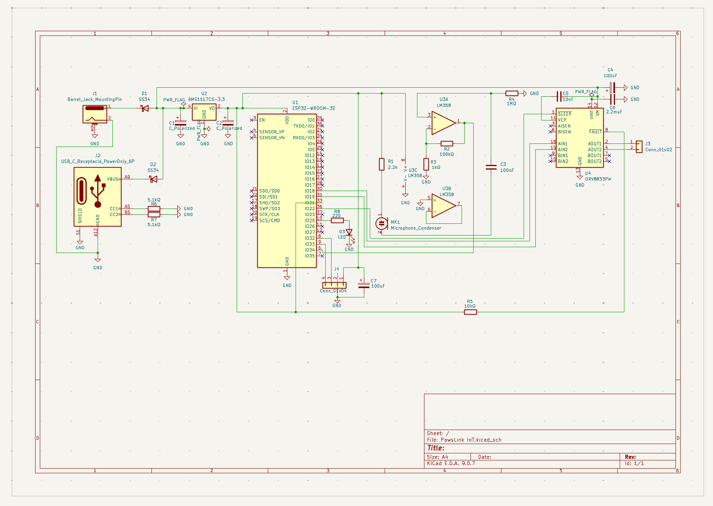
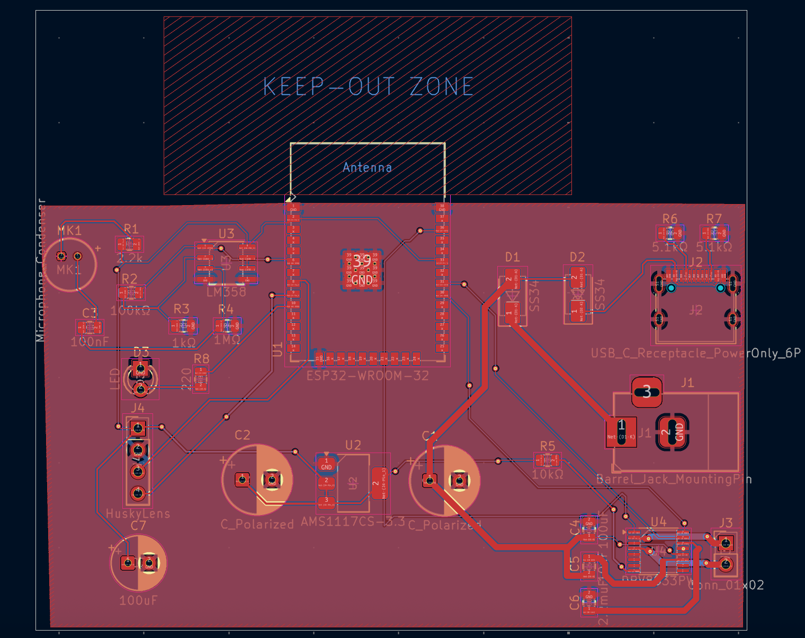
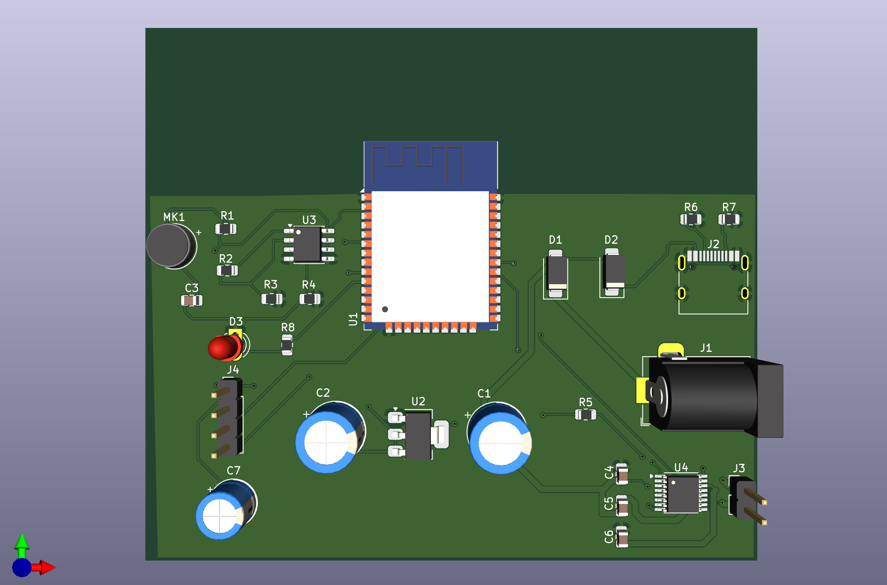

# 🐾 PawsLink IoT: The Elite Cat Gate Controller

Selam! Bu proje, evin asıl sahibi olan kedimin balkon kapısında mahsur kalma krizlerine (ve benim her seferinde bir "kapı görevlisi" edasıyla yerimden kalkmama) son vermek için geliştirildi. Başta küçük bir can sıkıntısı gibi görünse de, süreç içinde evrim geçirerek tam kapsamlı bir **Embedded System & IoT** projesine dönüştü.

## 📸 Tasarım Süreci ve Görseller

### 🎨 Şematik Tasarım
Projenin elektriksel bağlantıları ve ESP32 entegrasyonu:

---

### 🛣️ PCB Layout
Hassas sinyal yolları ve RF performansını korumak için tasarlanan Anten Keep-out bölgesi:

---

### 🧊 3D Modelleme
Üretim sonrası kartın fiziksel görünümü ve komponent yerleşimi:

## 🐱 Neden PawsLink?
Kedim, balkona çıkmak istediğinde kapının önünde kendine has bir frekansta seslenerek beni göreve çağırıyor. **PawsLink**, bu işitsel sinyalleri (miyavlamaları) algılayıp mekanik bir kolu tetikleyen, böylece kedime kendi özgürlüğünü sunan akıllı bir sistemdir.

## 🛠 Teknik Gelişim & Mühendislik Detayları
Proje başlangıçta **ATmega** tabanlıydı; ancak hem performansını artırmak hem de modern bağlantı özelliklerinden (Wi-Fi/Bluetooth) faydalanmak amacıyla mimariyi **ESP32**’ye taşıdım. Tasarımda dikkat ettiğim bazı kritik teknik noktalar:

* **RF Performansı (Anten Keep-out):** ESP32'nin üzerindeki PCB antenin verimli çalışması için, antenin altında kalan tüm katmanlarda bakır dökümü iptal edildi (No-copper zone).
* **Hassas PCB Layout:** USB-C güç girişi gibi yüksek yoğunluklu pinlerde kısa devre riskini önlemek için özel clearance (güvenlik mesafesi) ayarları yapıldı.
* **EMI ve Gürültü Yönetimi:** Güç hatları üzerine yerleştirilen decoupling kapasitörleri ile dijital gürültü minimize edildi, analog ses sensörünün daha kararlı çalışması sağlandı.
* **Hatasız Tasarım:** Endüstriyel standartlarda, **0 DRC Error** ve **0 Unconnected Items** ile üretime hazır hale getirildi.

 ---

# 🛠 Donanım Güncellemesi: V1.1 - Güç Optimizasyonu

Sistem kararlılığını ve motor performansını artırmak için yapılan iyileştirmeler:

* **Yol Kalınlaştırma (Power Tracks):** Motoru besleyen ana hatlar ve motor çıkış yolları **40 mil (~1.0 mm)** genişliğine çıkarıldı. Bu sayede motorun çektiği anlık akım, kartta ısınmaya veya voltaj düşümüne sebep olmadan güvenle iletilebiliyor.
* **Güç Otobanı:** Barrel Jack girişinden başlayarak Diyot, Kapasitörler ve Motor Sürücüye (DRV8833) giden hat "Güç Otobanı" mantığıyla optimize edildi. Bu güncelleme, motor zorlandığında bile ESP32'nin stabil çalışmasını (brown-out önleme) sağlar.
* **GND Plane:** Toprak hattı kesintisiz bakır döküm (GND Plane) olarak tasarlanarak hem parazitler engellendi hem de termal yönetim iyileştirildi.

---

## 📂 Dosya Yapısı
* `/Hardware`: KiCad şematik ve PCB layout dosyaları.
* `/Production`: Üretime hazır Gerber ve Drill dosyaları (PawsLink_Final_v1.zip).
* `/Firmware`: ESP32 için yazılmış IoT kontrol kodları.

---

### 🚀 Nasıl Çalışır?
1. PCB sipariş edilir ve bileşenler lehimlenir.
2. ESP32 yazılımı yüklenir.
3. Kedinin "miyav" frekansı kalibre edilir.
4. Koltuğa yaslanılır ve kedinin kendi kapısını açışı izlenir. ✨

---

## 🚀 Son Güncellemeler (Mayıs 2026)

Bu donanım revizyonu, güvenlik önlemlerine odaklanmakta ve sistemi akıllı yazılım entegrasyonuna hazırlamaktadır. Proje, kapı hareketi sırasında kedi güvenliğini sağlamak için proaktif önlemler içerecek şekilde geliştirilmiştir.

### Donanım v1.2 İyileştirmeleri
*   **Akıllı Engel Algılama**: HuskyLens entegrasyonu için özel bir 4-pinli konnektör (**J4**) eklendi. Bu sayede, mekanizma çalışmadan önce yapay zeka destekli algılama ile kedinin kapı eşiğinde olup olmadığı kontrol edilebilecektir.
*   **Görsel Durum LED'i**: Sistem durumunu ve olası engelleri gerçek zamanlı olarak bildirmek için yeni bir gösterge LED'i eklendi.
*   **Güç Kararlılığı**: ESP32 ve motor sürücüsünün yük altında kararlı çalışması için PCB yolları, net atamaları (USB-C pin eşleme düzeltmeleri dahil) ve bakır alanlar optimize edildi.
*   **Üretime Hazır Düzen**: Fiziksel PCB üretimine hazırlık amacıyla tasarım kuralı hataları (DRC) ve açıklık (clearance) ihlalleri giderildi.

### Güncel Proje Görselleri

#### Yeni Şematik Tasarımı

#### Yeni PCB Tasarımı

#### 3D Donanım Modeli

## 💻 Yazılım Özellikleri (Firmware)

Projenin yazılımı ESP32 üzerinde C++ (Arduino) kullanılarak geliştirilmiştir. Temel çalışma mantığı şu şekildedir:

* **Tetikleme:** LM358 amfi devresi üzerinden gelen analog ses verisiyle kedinin miyavlaması algılanır.
* **Güvenlik:** HuskyLens AI kamera, I2C üzerinden ESP32 ile haberleşerek kedinin kapı eşiğinde olup olmadığını denetler.
* **Akıllı Döngü:** Kapı sadece miyavlama duyulduğunda açılır ve kedi eşikten tamamen ayrıldığında (HuskyLens onayıyla) güvenli bir şekilde kapanır.
* **Enerji Tasarrufu:** DRV8833 motor sürücüsü, işlem yapılmadığı anlarda `SLEEP` moduna alınarak güç tüketimi minimize edilir.
---

*Not: Bu donanım versiyonu, bir sonraki aşama olan ESP32 yazılım geliştirme süreci için tamamen hazır durumdadır.*

**Not2:** Bu proje yapılırken hiçbir kedi mahsur bırakılmamıştır. Aksine, artık evin kapıları onun kontrolü altında! 🐈‍⬛🚀

